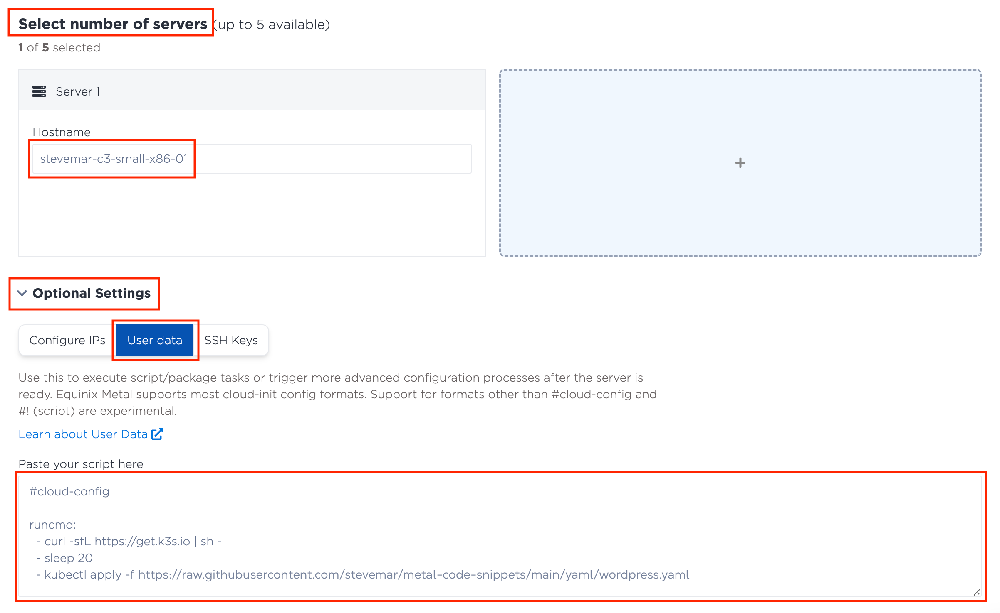
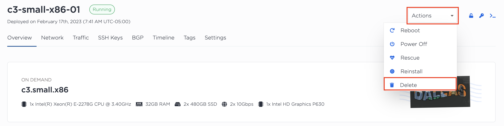

# Part 2: Provision a bare metal server and deploy Reactle with Kubernetes

In this part we'll begin to set up a bare metal server. We'll cover options such as metro locations, server types, and operating system choice.

## Steps

### 1. Choose your server metro, type, and operating system

From the navigation menu on the left, under the **Bare metal servers** option, click on **On demand**.


Choose a **metro**. We suggest the **Dallas** metro.


!!! note "Did you know...?"

    Equinix Metal supports over 20 regions around the world?

Choose a **server**. For our workshop, let's go with a `c3.small.x86` or `m3.small.x86` instance.


!!! question "Open discussion"

    * What do c3 and m3 mean?
    * What does x86 stand for?
    * For more information about server types, see our [documentation](https://deploy.equinix.com/product/servers/).

Choose an **operating system**. We recommend **Ubuntu 20.04 LTS**.


### 2. Configure your server's cloud init part

Under the **Select number of servers** option, click on the **Optional Settings** part, and then the **User data** tab.



Copy and paste the snippet of code below into the text box.

```yaml title=""
#cloud-config

runcmd:
  - curl -sfL https://get.k3s.io | sh -
  - sleep 20
  - kubectl apply -f https://raw.githubusercontent.com/cprivitere/react-wordle/main/reactle-kube-deploy.yaml
```

!!! question "Open discussion"

    * What are cloud init scripts?
    * What is this code doing?

Review your settings and click **Deploy Now** at the bottom of the page.


!!! info

    This example uses Kubernetes to deploy the sample application. Specifically, it uses [k3s](https://k3s.io/), a lightweight Kubernetes distribution. Jokes about Kubernetes aside, it has become the defacto approach to deploying cloud native applications.

    

### 3. View server details

From the left navigation, click on **Manage Servers**, it's under the **Bare metal servers** menu. You'll be presented with several details about all the servers you have deployed.

Here you can quickly and easily find information for each server, such as: _hostname_, _server type_, _public IP address_, _status_, _operating system_, and _location_.

Let's now click on the server you just created to get more information about it.


On this page you can do several post-provisioning tasks such as:

* Deleting and rebooting the server
* Viewing inbound and outbound traffic
* Auditing when and who provisioned the machine

Flip through a few sections to familiarize yourself with the overview page.


### 4. Verify the application is running

Click on the **Network** tab and find the public IP address.


Launch a browser and navigate to the following URL:

``` title=""
http://<ip-address>:31000
```

You should now be presented with a running application. In this case, the app running is called Reactle, a clone of the popular game, Wordle.


!!! example "Can't access the application?"

    If you're unable to access the applicaiton due to network security, try using a personal device, like a phone.

### 5. Clean up any resources

When you've wrapped up this part, don't forget to delete your server.



## Discussion

Before proceeding to the next part let's take a few minutes to discuss what we did. Here are some questions to start the discussion.

* What if we wanted to create 60 servers with 6 different locations?
* What if I want to install my own OS?
* What is an alternative to cloud init scripts?
* Let's go through the code that we copied.
