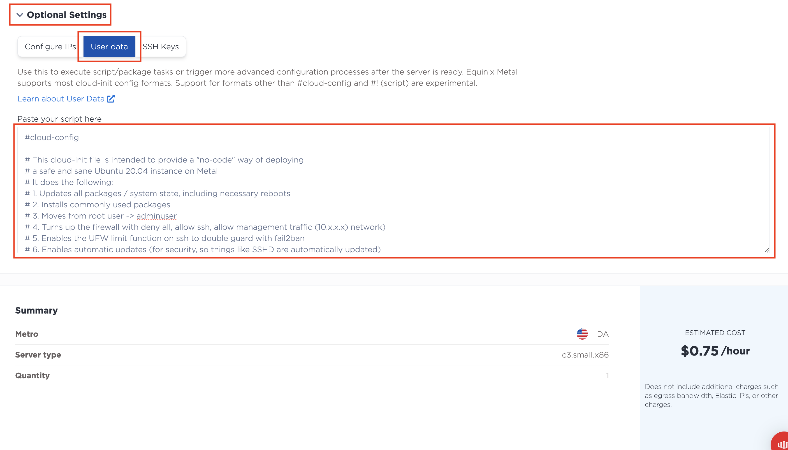
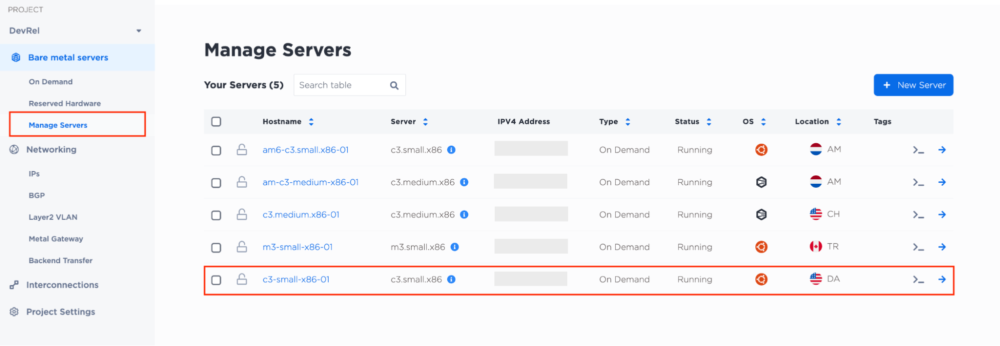
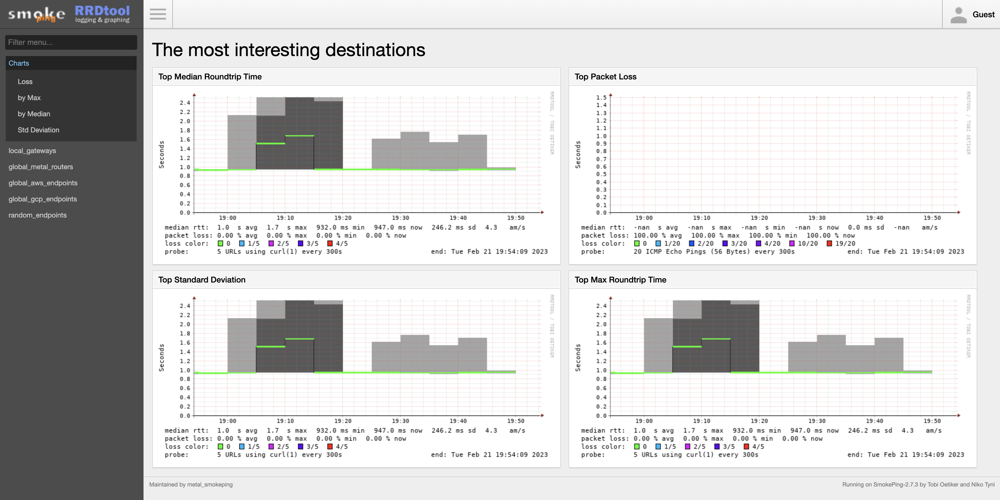
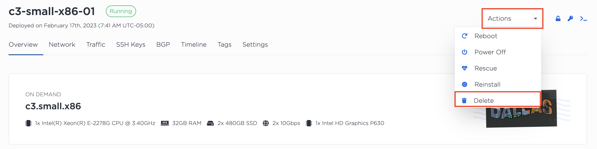

# Part 3: Investigate latency on Equinix Metal with SmokePing

In this part we'll investigate what latency is like on Equinix Metal servers.

## Steps

### 1. Provision another server

Navigate back to the **On Demand** section that we used in the previous part and create another server.

* Choose a metro
* Choose a server type, use  `c3.small.x86` or `m3.small.x86`.
* Choose an operating system, use **Ubuntu 20.04 LTS**.

Under *Select number of servers* give your server a unique hostname. Then click on **Optional Settings**, and then the **User data** tab.



Copy and paste the snippet of code below into the text box.

```yaml
#cloud-config

# This cloud-init file is intended to provide a "no-code" way of deploying
# a safe and sane Ubuntu 20.04 instance on Metal
# It does the following:
# 1. Updates all packages / system state, including necessary reboots
# 2. Installs commonly used packages
# 3. Moves from root user -> adminuser
# 4. Turns up the firewall with deny all, allow ssh, allow management traffic (10.x.x.x) network)
# 5. Enables the UFW limit function on ssh to double guard with fail2ban
# 6. Enables automatic updates (for security, so things like SSHD are automatically updated)
# 7. Enables fail2ban on SSHD
# 8. Downloads and runs the metal_smoke_instance.sh

# This is broken while dist-upgrade is available
# and it is since 22.04
package_upgrade: false
package_reboot_if_required: false

packages:
 - screen
 - sysbench
 - ethtool
 - fail2ban
 - iperf3
 - lshw
 - pciutils
 - ufw
 - vlan
 - arping
 - unattended-upgrades
 - unzip
 - strace
 - git
 - dnsutils
 - jq

groups:
 - cloud-users

users:
  - name: adminuser
    primary_group: cloud-users
    sudo: ALL=(ALL) NOPASSWD:ALL
    groups: [cloud-users, sudo]
    shell: /bin/bash

datasource_list: [Ec2, Equinix]
datasource:
  Ec2:
    strict_id: false

# keep sshd disabled till everything is done at the end of runcmd
bootcmd:
  - [ cloud-init-per, instance, systemctl, start, ssh ]
  - [ cloud-init-per, instance, systemctl, enable, ssh ]

runcmd:
  - yes | unminimize  &
  - [ bash, /usr/lib/apt/apt.systemd.daily ]
  - systemctl enable fail2ban
  - systemctl start fail2ban
  - systemctl enable unattended-upgrades
  - systemctl start unattended-upgrades
  - systemctl enable ufw
  - systemctl start ufw  
  - ufw default allow outgoing
  - ufw default deny incoming
  - ufw allow ssh
  - ufw allow http
  - ufw allow from 10.0.0.1/8
  - ufw limit ssh
  - ufw enable
  - echo "interface ignore wildcard" >> /etc/ntp.conf
  - echo "interface listen 127.0.0.1" >> /etc/ntp.conf
  - systemctl restart ntp
  - modprobe 8021q
  - echo "8021q" >> /etc/modules
  - mv /root/.ssh /home/adminuser/
  - chown -R adminuser:cloud-users /home/adminuser/.ssh
  - sed -i -e '/^#PermitRootLogin/s/^.*$/PermitRootLogin no/' /etc/ssh/sshd_config
  - echo "DebianBanner no" >> /etc/ssh/sshd_config
  - systemctl enable ssh
  - systemctl start ssh
  - curl --silent --retry 5 -o /tmp/metal_smoke_instance.sh https://raw.githubusercontent.com/dlotterman/metal_code_snippets/main/smokeping/metal_smoke_instance.sh
  - chmod 0750 /tmp/metal_smoke_instance.sh
  - bash /tmp/metal_smoke_instance.sh

write_files:
  - owner: root:root
    path: /etc/fail2ban/jail.local
    content: |
      [DEFAULT]
      bantime = 3600
      banaction = ufw
      ignoreip = 127.0.0.1/8 10.0.0.0/8
      findtime = 600
      maxretry = 5
      [sshd]
      enabled = true
      logpath = %(sshd_log)s
      mode = aggressive
    permissions: '0644'
  - owner: root:root
    path: /etc/apt/apt.conf.d/50unattended-upgrades
    content: |
      Unattended-Upgrade::Allowed-Origins {
      "${distro_id}:${distro_codename}";
      "${distro_id}:${distro_codename}-updates";
      "${distro_id}:${distro_codename}-security";
      "${distro_id}ESMApps:${distro_codename}-apps-security";
      "${distro_id}ESM:${distro_codename}-infra-security";
      };
    permissions: '0644'
  - owner: root:root
    path: /etc/apt/apt.conf.d/21auto-upgrades_on
    content: |
      APT::Periodic::Update-Package-Lists "1";
      APT::Periodic::Download-Upgradeable-Packages "1";
      APT::Periodic::AutocleanInterval "7";
      APT::Periodic::Unattended-Upgrade "1";
    permissions: '0644'
  - owner: root:root
    path: /etc/crontab
    append: true
    content: |
      05 * * * * root /usr/bin/unattended-upgrade -v
      05 11 * * * root systemctl restart sshd
      15 11 * * * root systemctl restart serial-getty@ttyS1.service
      20 11 * * * root systemctl restart getty@tty1.service
    permissions: '0644'
```

!!! question "Open discussion"

    * What is this code doing?

Review your settings and click **Deploy Now** at the bottom of the page.

### 2. View the application

From the left navigation, click on **Manage Servers**, it's under the **Bare metal servers** menu. Find the IP address of the server you just provisioned.



Launch a browser and navigate to the following URL:

```
http://<ip-address>
```

You should now be presented with a running application. In this case, the app running is called Smoke Ping, a tool used to measure latency.



### 3. Use Smoke Ping to find your servers best and worst latency

The Smoke Ping application is constantly sending packets to multiple well known endpoints around the world and tracking how long the response takes.

1. Take a look at the **global_metal_routers** section to see the average latency to other Equinix Metal endpoints. 
1. Take a look at the **global_aws_endpoints** section to see the average latency for AWS endpoints.
1. Take a look at the **global_gcp_endpoints** section to see the average latency for GCP endpoints.

!!! question "What does your latency look like?"

    If you provionsed a bare metal server in North America your latency should look like this:

    * Equinix Metal endpoints: 10 - 100 ms
    * AWS endpoints: 50 - 300 ms
    * GCP endpoints: 100 - 600 ms

### 4. Clean up any resources

When you've wrapped up this part, don't forget to delete your server.



## Discussion

Congratulations on completing the workshop! To wrap things up, let's discuss what was done in this part. Here are some questions to start the discussion.

* What was the highest and lowest latency you observed?
