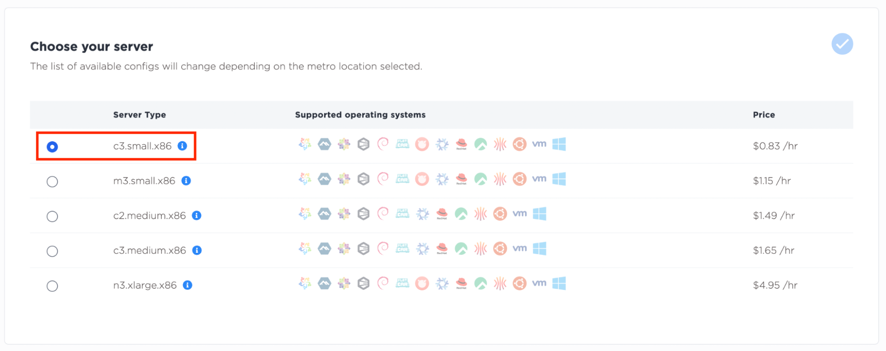
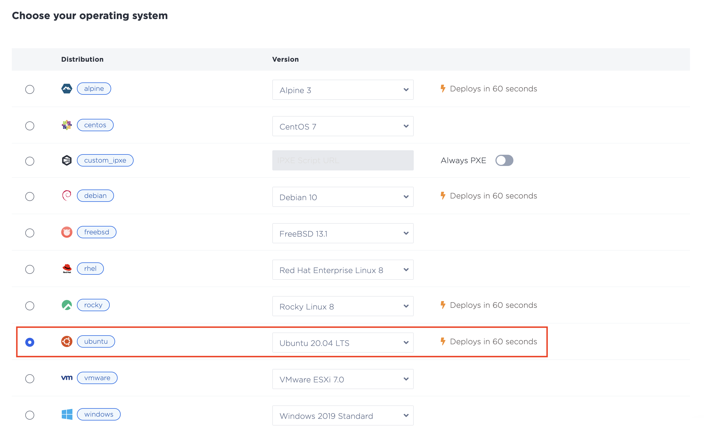
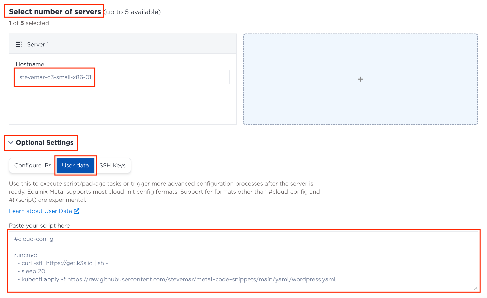
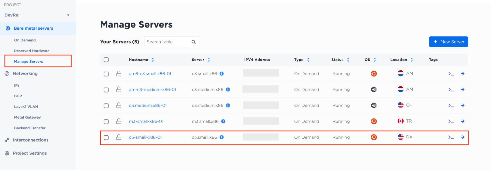
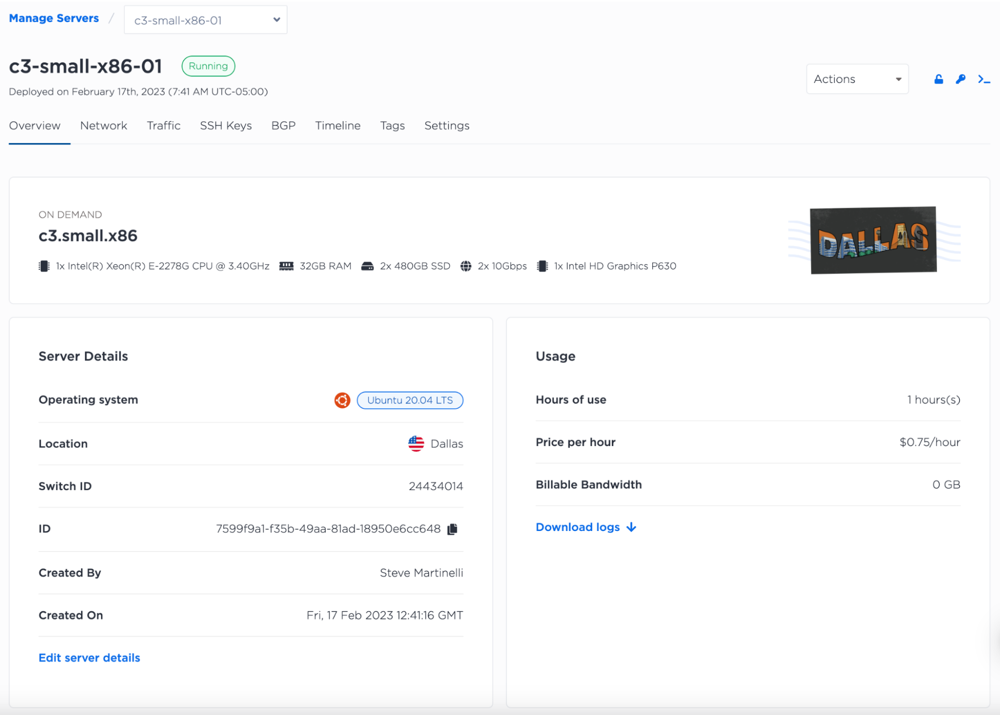

# Part 2: Provision a bare metal server and deploy Reactle with Kubernetes

In this part we'll begin to set up a bare metal server. We'll cover options such as metro locations, server types, and operating system choice.

!!! example "First time seeing the Equinix console?"

    If this is your first time in the Equinix console take a few mintues to familiarize yourself with our navigation menu.

## Steps

### 1. Choose your server metro, type, and operating system

From the navigation menu on the left, under the **Bare metal servers** option, click on **On demand**.


Choose a **metro**. We suggest the **Dallas** metro.


!!! note "Did you know...?"

    Equinix Metal supports over 20 regions around the world?

Choose a **server**. For our workshop, let's go with a `c3.small.x86` or `m3.small.x86` instance.



!!! question "Open discussion"

    * What do c3 and m3 mean?
    * What does x86 stand for?
    * For more information about server types, see our [documentation](https://deploy.equinix.com/product/servers/).

Choose an **operating system**. We recommend **Ubuntu 20.04 LTS**.



### 2. Configure your server with clout init

Under *Select number of servers* give your server a unique hostname. Then click on **Optional Settings**, and then the **User data** tab.



Copy and paste the snippet of code below into the text box.

```yaml
#cloud-config

runcmd:
  - curl -sfL https://get.k3s.io | sh -
  - sleep 20
  - kubectl apply -f https://raw.githubusercontent.com/cprivitere/react-wordle/main/reactle-kube-deploy.yaml
```

!!! question "Open discussion"

    * What are cloud init scripts?
    * What is this code doing?

Review your settings and click **Deploy Now** at the bottom of the page.


!!! info

    This example uses Kubernetes to deploy the sample application. Specifically, it uses [k3s](https://k3s.io/), a lightweight Kubernetes distribution. Kubernetes has quickly become the defacto approach for deploying cloud native applications.

### 3. View server details

From the left navigation, click on **Manage Servers**, it's under the **Bare metal servers** menu. You'll be presented with several details about all the servers you have deployed.

Here you can quickly and easily find information for each server, such as: _hostname_, _server type_, _public IP address_, _status_, _operating system_, and _location_.

Let's now click on the server you just created to get more information about it.



On this page you can do several post-provisioning tasks such as:

* Deleting and rebooting the server
* Viewing inbound and outbound traffic
* Auditing when and who provisioned the machine

Flip through a few sections to familiarize yourself with the overview page.



### 4. Verify the application is running

Click on the **Network** tab and find the public IP address.


Launch a browser and navigate to the following URL:

```
http://<ip-address>:31000
```

You should now be presented with a running application. In this case, the app running is called Reactle, a clone of the popular game, Wordle.


!!! example "Can't access the application?"

    If you're unable to access the applicaiton due to network security, try using a personal device, like a phone.

### 5. Clean up any resources

When you've wrapped up this part, don't forget to delete your server.


## Discussion

Before proceeding to the next part let's take a few minutes to discuss what we did. Here are some questions to start the discussion.

* What if we wanted to create 60 servers with 6 different locations?
* What if I want to install my own OS?
* What is an alternative to cloud init scripts?
* Let's go through the code that we copied.
