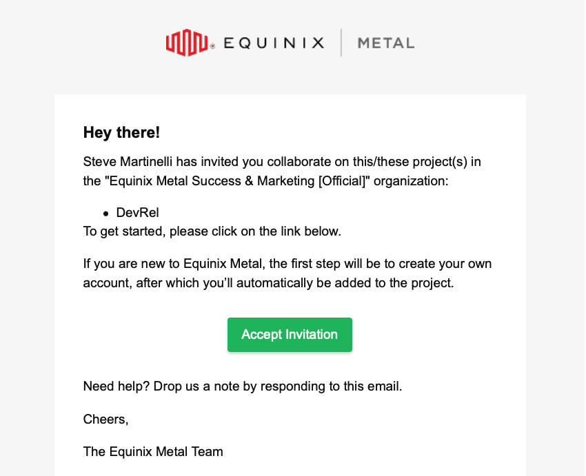
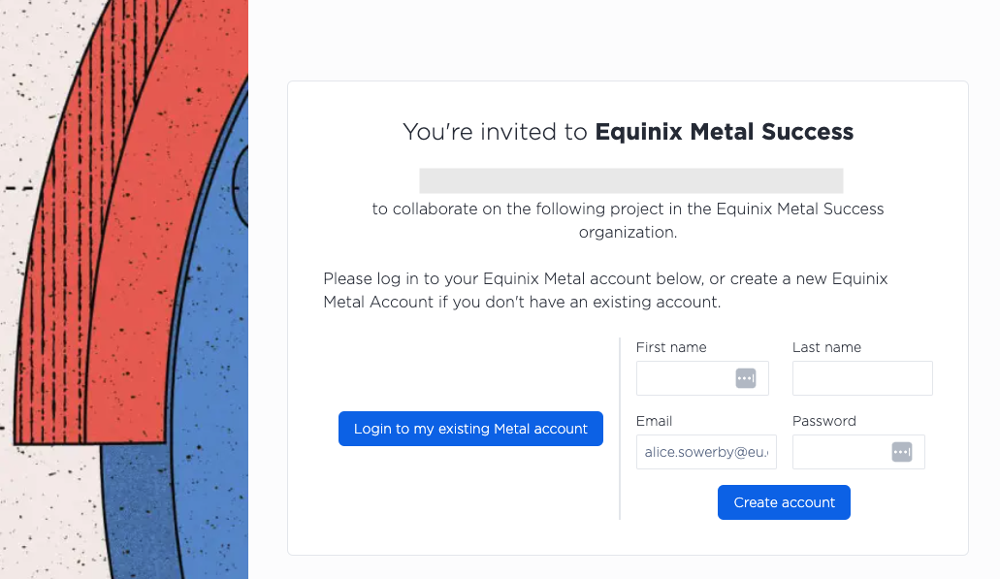
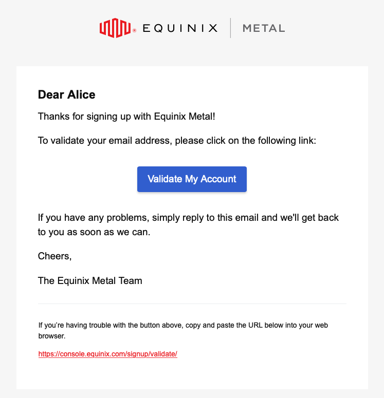
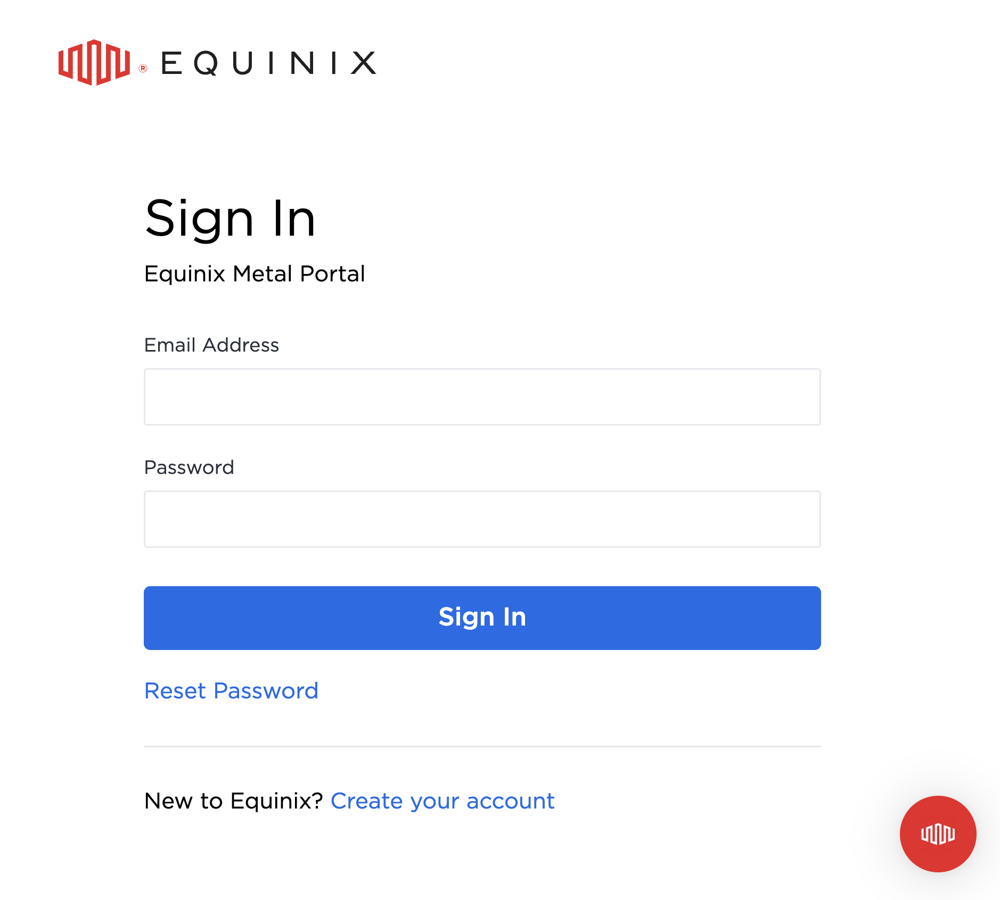

# Part 1: Setup an Equinix Metal Account

One of the quickest way to get started on Equinix Metal is to be invited into an existing organization. Let's do just that. In this part you'll be invited into an organization; you'll sign up for a new account; and you'll login with your new credentials.

## Steps

### 1. Accept the invitation

Check your inbox. You'll receive an email requesting that you join an organization on Equinix Metal. Click on **Accept invitation**.

### 2. Create an account

Fill in your first name, last name, email address, and a password. Click on **Create account**.

!!! tip

    * Your password needs to be at least 14 characters long.
    * You'll be using your password soon, don't forget it!
    * Note to **Equinix employees**, this will be a different set of credentials than your SSO.

### 3. Verify your email

You'll be asked to verify the email address of the account you just created. Click on **Validate My Account**.

### 4. Sign in

You'll be redirected to a login page. Type in your email address and password and click on **Sign In**. You're now ready to start creating your first bare metal server!

## Discussion

Before proceeding to the next part let's take a few minutes to discuss what we did. Here are some questions to start the discussion.

* What's an organization?
* What are alternate ways to get started?
